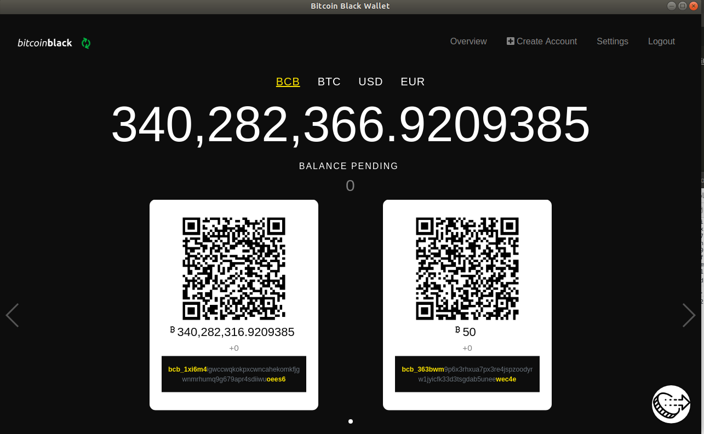

# Bitcoin Black Wallet

Bitcoin Black Wallet for desktop and web.

This is an Ember application that can build into an [Electron](https://electronjs.org/) app.

## Credits
This project was built on top of NANO wallet 
https://github.com/nano-wallet-company/nano-wallet-desktop

## Prerequisites

You will need the following things properly installed on your computer.

- [Git](https://git-scm.com/)
- [Node.js](https://nodejs.org/)
- [Yarn](https://yarnpkg.com/)
- [Google Chrome](https://google.com/chrome/)

## Installation

- `git clone https://github.com/bitcoin-black-bcb/bcb-wallet.git`
- `cd bcb-wallet`
- `yarn install`

## Running / Development

### Simple

- `yarn electron:start`
- The app will open in standalone electron session with developer tools.

### Code Generators

Make use of the many generators for code, try `npx ember help generate` for more details.

### Linting

- `yarn lint:js`
- `yarn lint:js --fix`

### Building

- `yarn build` (development)
- `yarn build --environment production` (production)

### Deploying

Specify what it takes to deploy your app.

## Further Reading / Useful Links

- [ember.js](https://emberjs.com/)
- [ember-cli](https://ember-cli.com/)
- Development Browser Extensions
  - [ember inspector for chrome](https://chrome.google.com/webstore/detail/ember-inspector/bmdblncegkenkacieihfhpjfppoconhi)
  - [ember inspector for firefox](https://addons.mozilla.org/en-US/firefox/addon/ember-inspector/)
